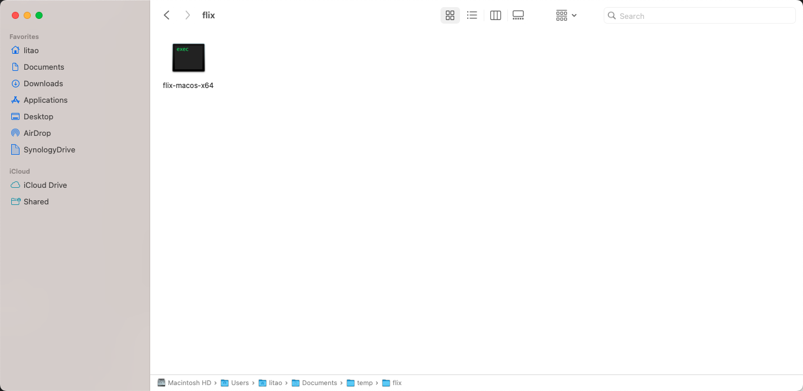
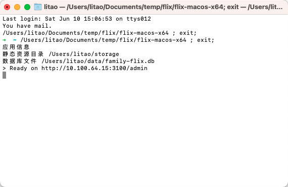

# 安装步骤

> 1. 该项目为开源项目，所有数据都是存储在你的电脑中，不会上传你的任何信息。联网的目的是为了索引云盘、搜索影视剧信息。
> 2. 目前仅支持阿里云盘
> 3. 如果需要在微信观看视频，需要知道如何手机端抓包查看网络请求。

## 环境配置

要求 nodejs@16

## 下载源码

创建一个新文件夹，进入该文件夹依次执行下面命令

```bash
# 后端源码
git clone https://github.com/family-flix/api.git
```

```bash
# 管理后台前端源码
git clone https://github.com/family-flix/admin1
```

```bash
# 视频播放移动端源码
git clone https://github.com/family-flix/mobile1
```

```bash
# 视频播放 PC 端源码
git clone https://github.com/family-flix/pc2
```

<!-- 首先下载应用程序
[FamilyFlix.1.1.0 - 阿里云盘](https://www.aliyundrive.com/s/ozTbv2mPeZd)
[FamilyFlix.1.1.0 - Github](https://github.com/family-flix/api/releases/tag/v1.1.0) -->

<!-- 下载自己对应平台的压缩包，分别是 linux、macos 和 win 三个平台。下载到本地解压后是一个应用程序，双击打开即可。 -->

<!-- 
解压后的文件 -->

<!-- 双击后会打开终端并执行该应用程序，可以看到终端会输出一些信息，最后会显示 `Ready on http://xxx.xx.xx`的字样，出现该文字说明启动成功了。
 -->

依次进入项目安装依赖并启动即可，启动成功后，

## 管理员注册

打开显示的网址，我的是 `http://10.100.64.15:3100/admin`，不同电脑这个网址是不同的，打开自己终端界面上出现的即可。

打开后会要求先注册，邮箱需要是正确的邮箱格式，但目前不会发送邮件校验；密码需要是字母和数字，不少于 8 位；而且只能注册一个管理员账号。

> 管理员账号是为了保护自己云盘的数据安全。


## 新增云盘

注册成功后会自动跳转到首页，需要我们添加云盘。点击首页「添加云盘按钮」，会出现下面的步骤说明，按该步骤操作即可。


添加成功后需要设置索引根目录，即你的影视剧资源存放的目录。

> 建议新增一个 `downloads`或 `medias`文件夹。

云盘内没有文件夹时会出现下面的弹窗，需要你先新增一个文件夹。


如果已经有文件夹了，会展示你云盘内的文件夹列表


选择你要作为索引目录的文件夹，再点击「确认」按钮即可。

## 刮削资源

至此，安装流程就结束了，如果云盘索引文件夹内已经有影视剧资源，直接点击首页云盘的「索引」按钮即可。

没有影视剧资源，那接下来需要寻找影视剧资源，转存到自己的云盘后进行索引。

> 建议之后所有的「转存」操作都在该网站中进行，因为当你转存的电视剧是连载的，除了索引电视剧信息外，还会将电视剧与分享资源关联，支持后续的「自动更新」操作。

下面介绍如何在 FamilyFlix 转存资源。
